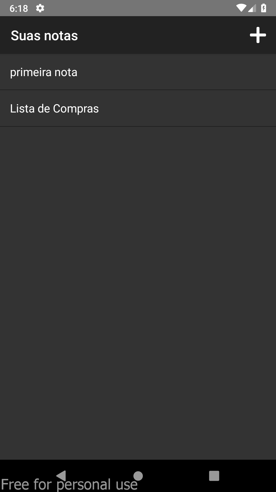
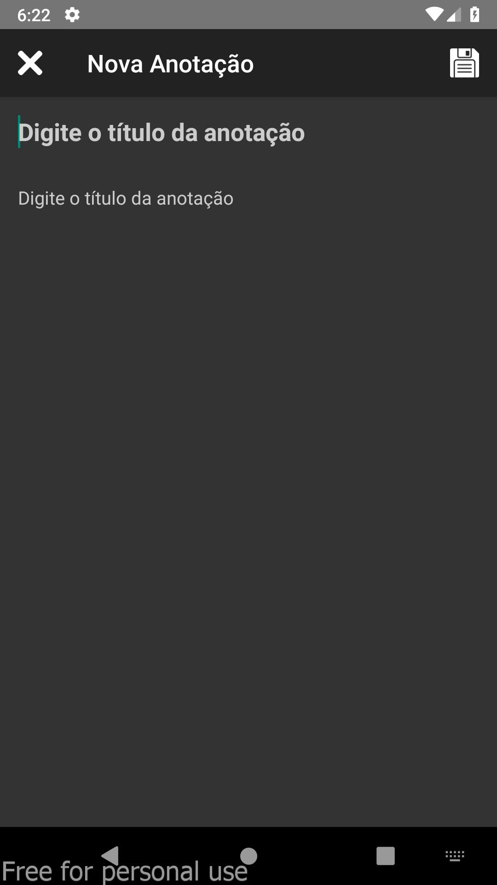
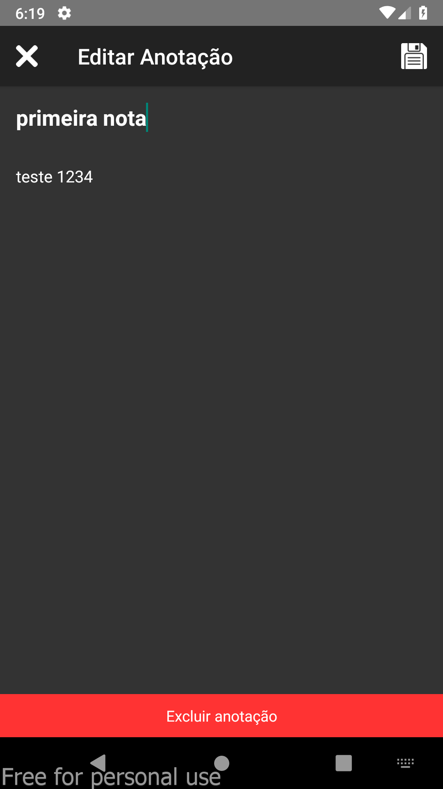

# Save Notes - React Native

[![Contributors][contributors-shield]][contributors-url]
[![Forks][forks-shield]][forks-url]
[![MIT License][license-shield]][license-url]
[![LinkedIn][linkedin-shield]][linkedin-url]

[contributors-shield]: https://img.shields.io/github/contributors/celsodias12/save-notes-RN?style=for-the-badge
[contributors-url]: https://github.com/celsodias12/save-notes-RN/graphs/contributors
[forks-shield]: https://img.shields.io/github/forks/celsodias12/save-notes-RN?style=for-the-badge
[forks-url]: https://github.com/celsodias12/save-notes-RN/network/members
[license-shield]: https://img.shields.io/github/license/celsodias12/save-notes-RN?style=for-the-badge
[license-url]: https://github.com/celsodias12/save-notes-RN/blob/main/LICENSE
[linkedin-shield]: https://img.shields.io/badge/-LinkedIn-black.svg?style=for-the-badge&logo=linkedin&colorB=555
[linkedin-url]: https://www.linkedin.com/in/celsodias12

<p float="center">
  
  
  
</p>

React Native app to create, save and delete notes.

## Installation

Use the package manager [npm](https://nodejs.org/en/) to install the packages needed to run the project.

```bash
npm i
```

## Usage

For Android run:

```javascript
npm run android
```

For IOS run:

```javascript
npm run ios
```

<!-- | Variables | Value |
| --------- | ----- |
|           |       |
|           |       | -->

## Contributing

Pull requests are welcome. For major changes, please open an issue first to discuss what you would like to change.

Please make sure to update tests as appropriate.

## License

[MIT](https://choosealicense.com/licenses/mit/)
